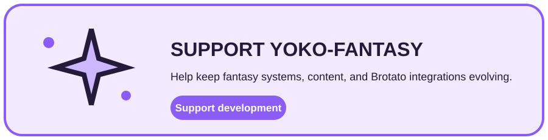

<div align="center">
  <h1>Yoko-Fantasy</h1>
  <p><strong>A systems-heavy fantasy expansion for Brotato, combining content with mechanics attached to existing game systems.</strong></p>
  <p>Jobs · Souls · Holy · Erosion · Combat · Enemies · Worlds · UI</p>
  <p>
    <a href="https://github.com/CYoJkoY/Yoko-Fantasy/releases"></a>
    <a href="https://github.com/CYoJkoY/Yoko-Fantasy/actions/workflows/release.yml"></a>
    
    
    <a href="LICENSE"></a>
  </p>
  <p><a href="#what-it-is">Overview</a> · <a href="#systems">Systems</a> · <a href="#architecture">Architecture</a> · <a href="#installation">Install</a> · <a href="#development--support">Development</a></p>
</div>

> **Core boundary:** Godot resources define fantasy content, NewContentLoader handles common registration, and focused extensions integrate only the Brotato systems that need custom behavior.

##  What it is

Yoko-Fantasy is a content and gameplay expansion for Brotato. It targets mechanics that need more than a resource definition but do not justify a separate gameplay framework.

```text
Content resources → NewContent registration → Targeted extensions → Brotato runtime
```

##  Systems

| System | Scope |
| :--- | :--- |
| Jobs | Job resources, registration, run integration, menu flow, end-of-run handling |
| Soul | Soul stats, consumables, drops, player / run integration |
| Holy | Holy stats, item interactions, enemy behavior |
| Erosion | Erosion-focused items and effects |
| Limited Items | Restricted pools and progression bonuses |
| Combat | Kill progression, reload triggers, weapon switching, lightning chains, hit effects, reflection, critical interactions |
| Enemies | Custom enemies, cursed behavior, targeting, spawning, healing, world interactions |
| Entities | Pets, turrets, gardens, wandering bots, special entities |
| Shop & Waves | Shop interactions, rerolls, synthesis, extra enemies, elites, wave behavior |
| World | Fantasy zones, backgrounds, title-screen resources, map behavior |
| UI & Localization | Menu integration, focus handling, descriptions, translations |

Representative content includes Holy and Blazing Path variants, Prism Tower, Healing Star, Soul Link, Crow, fantasy pets, and plant-themed enemies.

##  Architecture

`mod_main.gd` installs the explicit integrations used by the expansion. `FantasyNewContent.gd` connects the project to [Yoko-NewContentLoader](https://github.com/CYoJkoY/Yoko-NewContentLoader) and supplies project-specific registration hooks.

| Resource | Role |
| :--- | :--- |
| `NewContentData.tres` | Primary content registration |
| `NewContentDataDLC1.tres` | Additional content registration |
| `FantasyNewContent.gd` | Custom registration and content hooks |

The architecture keeps content inspectable while attaching deeper behavior to the owning Brotato subsystem.

##  Installation

Requirements: **Brotato 1.15.4**, **Brotato Mod Loader 6.3.0**, [Yoko-NewContentLoader](https://github.com/CYoJkoY/Yoko-NewContentLoader), and [Yoko-MoreStatsContainer](https://github.com/CYoJkoY/Yoko-MoreStatsContainer).

1. Install Brotato and the required Mod Loader version.
2. Install both required Yoko dependencies.
3. Download the latest `Fantasy-*.zip` from [Releases](https://github.com/CYoJkoY/Yoko-Fantasy/releases).
4. Place the ZIP in the Mod Loader `mods` directory.
5. Launch Brotato and verify the dependency chain loads.

##  Development & support

When adding a mechanic, identify the owning Brotato system first and add the smallest required extension.

```text
New mechanic
   ├── Content / resource → content/
   ├── Runtime behavior   → extensions/
   ├── Registration       → mod_main.gd / NewContentData*.tres
   └── Localization       → translations/
```

`manifest.json` is authoritative for version **1.1.0**, dependencies, and compatibility. The release workflow rejects tags that do not match the manifest.

<a href="https://cyojkoy.github.io/Payment/"></a>

Development support: **https://cyojkoy.github.io/Payment/**

## License

Yoko-Fantasy is distributed under the [MIT License](LICENSE).
